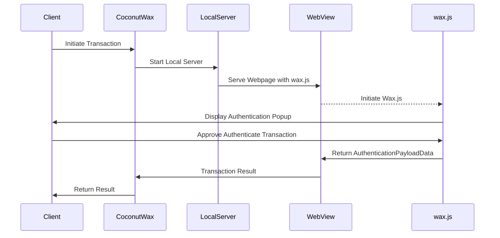
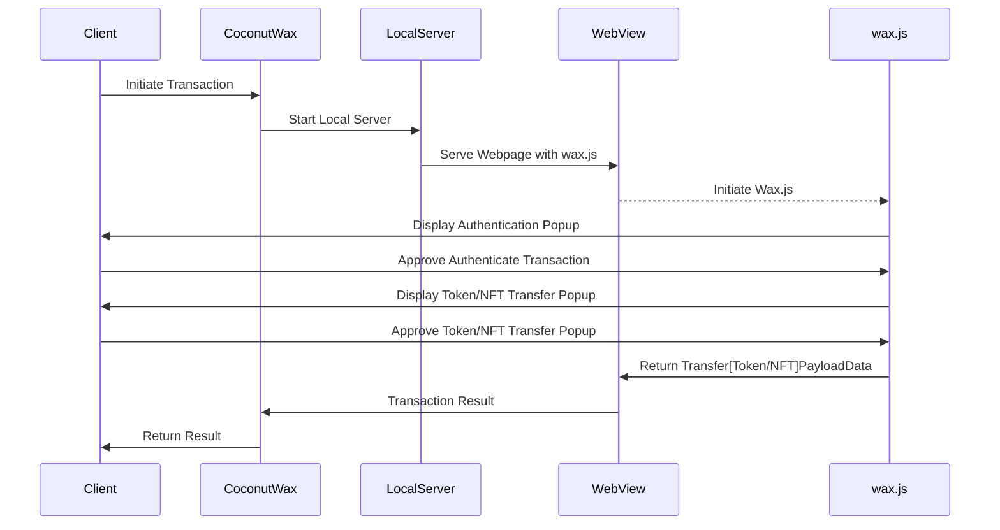
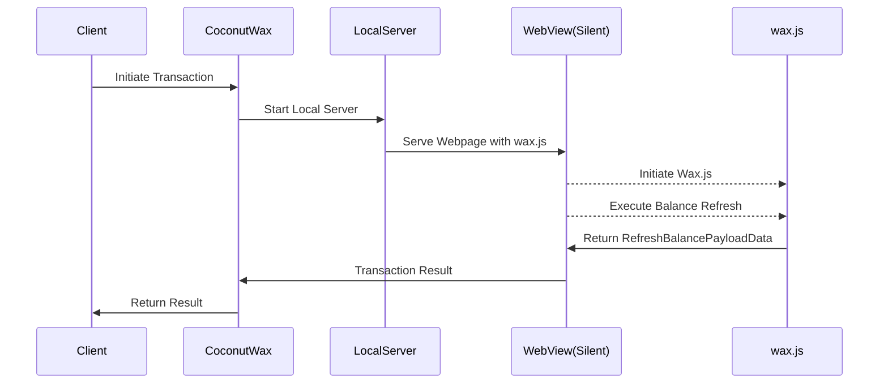

# CoconutWAX
# Table Of Contents
- [Introduction](#introduction)
	- [Implemented Features](#implemented-features)
	- [External Helper Functionalities](#external-helper-functionalities)
	- [Version Support](#version-support)
- [Installation](#installation)
	- [UPM Package](#upm-package)
	- [Sample Overview](#sample-overview)
- [Quick Start](#quick-start)
	- [Get Started](#get-started)
	- [CoconutWax Main class](#coconutwax-main-class)
		- [Key Methods of CoconutWax Class](#key-methods-of-coconutwax-class)
		- [Payload Section](#payload-section)
- [Platform specific setup](#platform-specific-setup)
- [Logging](#logging)
- [CoconutWax Workflow Diagram](#coconutwax-workflow-diagram)
	- [Authentication Diagram](#authentication-diagram)
	- [Token/NFT Transfer Diagram](#tokennft-transfer-diagram)
	- [Account Balance Refresh Diagram](#account-balance-refresh-diagram)
	- [Exception Handling](#exception-handling)
- [License](#license)
# Introduction
Having identified a gap with a secure and working Unity SDK for the WAX wallet to support Android and iOS apps and games. We have created one for the community and hope it is useful! 

The Double Coconut WAX SDK is a full-fledged solution for easy and enhanced integration of the Wax Cloud Wallet, allowing for blockchain functionality into your apps. It bridges JavaScript and C# to make the experience of developers working with the WAX blockchain easy and seamless.

A sample Unity project is included for ease of integration.

The Double Coconut Wax SDK is committed to evolving and expanding its feature set, ensuring that developers have all the tools they need to build powerful applications on the Wax blockchain.

### Implemented Features
- **Authentication**: Manage user sessions with straightforward login and logout functionality.
- **Custom Avatar**: Users of MyCloudWallet can get their custom avatar.
- **Custom Token Contracts**: Include specific contract tokens in the SDK configuration, allowing precise token balance retrieval and manipulation of those tokens.
- **User Account Balance**: Fetch and update user account balances effortlessly for all fungible tokens.
- **Account NFT Collection**: Retrieve a list of NFTs owned by the user.
- **Transactions**: Execute transactions seamlessly.
	- **Token Transfer**: Transfer tokens from one account to another with ease.
	- **NFT Transfer**: Transfer NFTs between accounts.

### External Helper Functionalities
- **Wallet Sample**: A fully-featured wallet project that integrates all SDK functionalities, along with additional features such as UI services, session storage, atomic asset manipulation, and exception handling.
- **Coconut Wax Editor Tool**: This tool automates the SDK integration process, streamlining development workflows.
- **Uniwebview SDK Integration**: Compiled into binary files, this dependency is automatically installed 
through the Coconut Wax Editor and opens a web browser view in your game / app where the cloud wallet web application can be cleanly embedded.


#### Version Support
**Supported Unity Editor Versions!**
| Version  | Support |
|----------|---------|
| 2020.3.x |  ✅     |
| 2021.3.x |  ✅     |
| 2022.3.x |  ✅     |

**Supported Platforms!**
| Platform  			 | Support |
|------------------------|---------|
| Android  				 |  ✅     |
| iOS  	    			 |  ✅     |
| Mac OS    			 |  ✅     |
| Windows   			 |  ❌     |
| Mac OS(Unity Editor)   |  ✅     |
| [Windows(Unity Editor)](https://docs.uniwebview.com/guide/faq.html#which-platforms-could-uniwebview-work-on)  |  ❌     |
| WebGL  				 |  ❌     |

# Installation
### UPM Package
Here are the detailed instructions for installing and setting up the Double Coconut WAX SDK:
1.  **Install the CoconutWax Package:**
    -   Open the Package Manager in your Unity project.
    -   Select "Add package from git URL" and paste the following URL:
        `https://github.com/double-coconut/coconut-wax.git?path=src/Package/com.doublecoconut.coconutwax#master` 
2.  **Setup the SDK:**
    -   After the package installation is complete, navigate to the toolbar in Unity.
    -   Select `CoconutWax -> Setup`.
    -   A setup window will pop up where you can complete the setup process.
3.  **Import the Sample (Optional):**    
    -   If you want to try the sample application and explore all the features and implementations, hit the `Import Sample` button after completing the SDK setup process.

### Sample Overview
After importing the sample project, follow these steps to run it:
1.  Navigate to your Assets folder.
2.  Open the scene located at: `Sample -> com.doublecoconut.coconutwax -> CoconutWaxWallet -> Scenes -> SampleScene.unity`.

> **Note:** Make sure you have selected the correct platform (Android, iOS, Standalone) before running the scene.

# Quick Start

### Get Started
To quickly get started with CoconutWax in your project, follow these steps:
1.  **Add CoconutWaxRuntime Component:**
    -   Create an empty GameObject in your Unity scene.
    -   Attach the `CoconutWaxRuntime` component to the GameObject.
2.  **Optional: Set Custom Port:**
    -   In the component properties, you can set a custom port if needed/required (default port is 2023).
3.  **Accessing the SDK:**    
    -   From your scripts, you can access the main SDK class using:
       ```csharp
         CoconutWaxRuntime.Instance.CoconutWax
       ```
    -   This will give you access to the methods necessary to perform actions with the SDK.

### CoconutWax Main Class

`CoconutWax` is a simple C# class whose instance is created in the `CoconutWaxRuntime` component. However, you can avoid using that component and create a new instance of `CoconutWax` directly in your code using the `new` keyword.

### Key Methods of CoconutWax Class:

1.  **Authenticate**
    -   **Description:** An asynchronous method that authenticates the user with the specified token contracts.
    -   **Parameters:**
        -   `tokenContract`: Pass the contracts of the tokens you want to display in the balance area (example: `"eosio.token"` for WAX balance).
    -   **Returns:** `AuthenticationPayloadData` (see more under the Payload section).
```csharp
AuthenticationPayloadData authData = await coconutWax.Authenticate("eosio.token"); 
```


2.  **TransferNFT**
    -   **Description:** An asynchronous method that transfers the NFT to the specified account.
    -   **Parameters:**
        -   `toAccount` (string): The desired account where you want to transfer your NFT.
        -   `assetIds` (string array): An array of NFT IDs which you want to transfer.
        -   `memo` (string, optional): A message for the transfer.
    -   **Returns:** `TransferNFTPayloadData` (see more under the Payload section).
```csharp
TransferNFTPayloadData nftTransferData = 
	await coconutWax.TransferNFT("recipient_account", new string[] {
	 "asset_id_1",
	 "asset_id_2"
	}, "optional memo");
```


3.  **TransferToken**
    -   **Description:** An asynchronous method that transfers the token to the specified account.
    -   **Parameters:**
        -   `toAccount` (string): The account to transfer the token to.
        -   `amount` (string): The amount of the token to transfer.
        -   `tokenContract` (string): The token contract for the transfer.
        -   `symbol` (string): The symbol of the token.
        -   `memo` (string, optional): The memo for the transfer.
    -   **Returns:** `TransferTokenPayloadData` (see more under the Payload section).
```csharp
TransferTokenPayloadData tokenTransferData = 
	await coconutWax.TransferToken(
		"recipient_account",
		"1",
		"eosio.token",
		"WAX",
		"optional memo"
	);
```


4.  **RefreshBalance**
    -   **Description:** An asynchronous method that refreshes the balance of the specified user account.
    -   **Parameters:**
        -   `tokenContract` (string): The token contract for the balance refresh.
        -   `userAccount` (string): The user account to refresh the balance.
    -   **Returns:** `RefreshBalancePayloadData` (see more under the Payload section).
```csharp
RefreshBalancePayloadData balanceData = 
	await coconutWax.RefreshBalance("eosio.token", "user_account");
```
### Payload Section:
-   `AuthenticationPayloadData`: Contains the data returned by the `Authenticate` method.
-   `TransferNFTPayloadData`: Contains the data returned by the `TransferNFT` method.
-   `TransferTokenPayloadData`: Contains the data returned by the `TransferToken` method.
-   `RefreshBalancePayloadData`: Contains the data returned by the `RefreshBalance` method.


# Platform specific setup
### Android
- Enable clear text traffic in the UniWebView plugin, see details [here](https://docs.uniwebview.com/guide/faq.html#the-page-does-not-load-on-android-but-shows-net-err-cleartext-not-permitted)
- Under the Project Settings -> Player -> [Android Platform] -> Publishing Settings
	- In the Build section, enable the `Custom Main Manifest` and `Custom Gradle Properties Template` options.
- Make sure `android.useAndroidX=true` is enabled in the `gradleTemplate.properties` file.
### iOS
> Nothing specific is required

# Logging
The Double Coconut WAX SDK includes its own logging system with various levels of logging to help you monitor and debug the SDK's activities. The logger can be accessed and configured through the `CoconutWaxLogger` static class.
- You can configure the logger's behavior by setting the log type using the static method `SetLogType(LogType logType)`.

The `LogType` enum in the Double Coconut WAX SDK is used to define the different levels of logging that can be enabled. Each log type corresponds to a different severity or category of log messages. You can combine multiple log types using bitwise operations to customize the logging behavior.

**Enum Values**
- **None**
	- Disables all logging. No log messages will be recorded.
- **Log**
	- Enables logging of regular log messages.
- **Warning**
	- Enables logging of warning messages, indicating potential issues.
- **Error**
	- Enables logging of error messages, indicating problems that need attention.
- **Verbose**
	- Enables verbose logging, including all types of log messages (regular, warning, and error).

To set the log type to a combination of different log levels, you can use the bitwise OR operator:
```csharp
// Enable logging for warnings and errors only
CoconutWaxLogger.SetLogType(LogType.Warning | LogType.Error);
```

## Double Coconut WAX SDK Workflow Diagram
### Authentication Diagram
The authentication process in the Double Coconut WAX SDK begins when the client initiates a transaction to authenticate. The Double Coconut WAX SDK starts a local server to facilitate the operation and serves a webpage containing the wax.js script through a WebView. Wax.js then initiates and presents an authentication popup to the client. The client approves the authentication transaction via this popup. Wax.js captures the authentication payload data and sends it back to the WebView, which then relays the transaction result to the SDK. Finally, the SDK returns the authentication result to the client.

### Token/NFT Transfer Diagram
When the client initiates a token or NFT transfer, the Double Coconut WAX SDK starts a local server to manage the process and serves a webpage with the wax.js script using a WebView. Wax.js initiates and displays an authentication popup to the client, who must first approve this transaction. Once authenticated, wax.js presents a token or NFT transfer popup to the client. Upon client approval, wax.js gathers the transfer payload data and sends it back to the WebView. The WebView then communicates the transaction result to the SDK, which subsequently returns the final result to the client.


### Account Balance Refresh Diagram
For refreshing the account contract token balance, the client initiates the transaction through the Double Coconut WAX SDK, which starts a local server. This server serves a webpage with the wax.js script using a silent WebView to avoid interrupting the user experience. Wax.js initiates and executes the balance refresh operation silently. It then returns the refreshed balance payload data to the silent WebView, which sends the transaction result back to CoconutWax. Finally, the SDK communicates the result of the balance refresh to the client.


## Exception Handling
if something goes wrong, the methods will throw an exception and you can catch it and handle it yourself
```csharp
private async void OnAuthButtonClicked() {  
	try {  
        AuthenticationPayloadData payloadData =  
            await CoconutWaxRuntime.Instance.CoconutWax.Authenticate();  
		// Handle when authentication has been completed successfully
    }  
    catch (Exception e) {  
	    // Handle failed authentication
    }  
}
```

## License
This code is open source per the MIT License.
UniWebView - Source code for the UniWebView package was purchased and compiled into binaries, and then included in the SDK. This may not be redistributed or modified.
